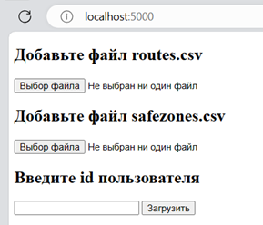
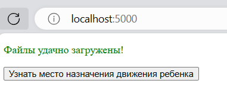
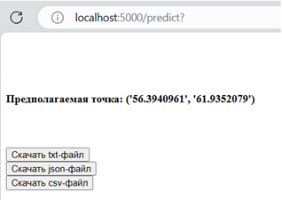

# Приложение для предсказания направления движения на основе ML модели

## О приложении

Приложение предназначено для выполнения предсказания конечной точки маршрута пользователя на основе исторических данных о его передвижениях.

Программа написана на Python с использованием с использованием фреймворка Flask и принципами REST API.
Внутри системы используется рекуррентная нейронная сеть долгой краткосрочной памяти [LSTM](https://colah.github.io/posts/2015-08-Understanding-LSTMs/), которая была написана при помощи библиотеки 
TensorFlow на языке программирования Python. Веб-приложение состоит из основного класса app.py, в котором происходит выполнение функции согласно запросам пользователя. 

### Интерфейс приложения

*  Стартовое окно программы

 
 На данном этапе пользователю необходимо загрузить данные о проделанных маршрутах (routes.csv),
 безопасных местах (наиболее часто посещаемых - safezones.csv) и идентификаторе пользователя (в данном случае id ребенка).

 * Окно проверки входных данных

В случае добавления пользователем корректных данных система начинает их обработку и поиск конечной координаты для последнего среди загруженных маршрутов.

 * Результат работы системы.

Пользователю предоставляется возможность скачивания полученных данных в разных форматах.

